# FRONTIER-AL — Login / Authentication / Wallet-Connect Flow Map

**Status:** durable reference, generated by a read-only research pass, 2026-07-07.
**Scope:** every entry point, button, client function, server route, and state
change involved in getting a player from "arrives at a URL" to "authenticated
in `/game`." Source of truth for future chats — re-verify file:line anchors
before relying on them, since this is a snapshot, not a live contract.

## Overview

FRONTIER-AL ships as **one client bundle deployed to two hosts**: Fly.io
(`frontiernext.fly.dev`, Express + Postgres backend, same-origin) and Cloudflare
Pages (`frontierprotocol.app`, static-only, no backend behind it). Both serve
the identical React/wouter SPA; `client/src/lib/backendOrigin.ts` decides at
runtime whether `/api` and the WebSocket resolve same-origin (Fly, localhost)
or cross-origin to the Fly backend (the branded domain, previews). Routing is
one shared `<WalletProvider>` (backed by `@txnlab/use-wallet-react`) hoisted
above a wouter `<Switch>` in `App.tsx`, with `/university` and `/admin`
deliberately mounted outside it. Auth is **wallet-signature-based** ("Sign In
With Algorand"): the wallet signs a 0-ALGO self-payment carrying a
server-issued nonce as its note; the server verifies the ed25519 signature and
mints an HMAC session token (`server/auth.ts`), delivered as both a cookie and
a `Bearer` token (the latter is primary — it survives the cross-origin branded
deploy where third-party cookies are unreliable). A parallel **dev/test
login** (`POST /api/dev/quick-auth`, gated by `DEV_LOGIN_ENABLED=true`) lets
testers play as a shared, non-spendable `DEV-TEST-COMMANDER` sentinel with no
wallet at all — it is wired into the landing page's "Dev / Test Mode" button
and into the in-game faction-select gate. Several popup/re-auth races (the
"12 wallet popups" storm, forced-dev-wallet hijack, duplicate signature
prompts on route remount) were found and fixed across 2026-07-06/07 sessions;
residual, device-unverified gaps are called out below.

---

## Mermaid flowchart

```mermaid
graph TD
    subgraph Entry["Entry points"]
        A1["frontierprotocol.app (Cloudflare Pages, static, no backend)"]
        A2["frontiernext.fly.dev/ (Fly, Express)"]
        A3["frontiernext.fly.dev/game (Fly, direct link)"]
    end

    A1 -->|GET /, real browser Accept:text/html| LP[LandingPage /]
    A2 -->|"Accept:text/html + normal UA -> next() -> SPA"| LP
    A2 -->|"curl / bot: no text/html Accept -> bare text"| BARE["'Frontier server running' plain text\n(server/index.ts:206)"]
    A3 --> GP[GamePage /game]

    LP --> NAV["LandingNav: Home/Economics/Gameplay/Features/Updates buttons\n(landing-shared.tsx:126)"]
    LP --> HERO1["'▶ Enter Game' button (handleEnter)\nlanding.tsx:655"]
    LP --> HERO2["'⚙ Dev / Test Mode' button (handleDevMode)\nlanding.tsx:663, only if VITE_DEV_MODE"]
    LP --> HERO3["'✦ Play the Story' <a href=/story/>\nlanding.tsx:673"]
    LP --> CLAIM["'Claim Rank ->' buttons (tier modal, X/Twitter DM)\nlanding.tsx:442"]
    LP --> PLAYNOW["'Play Now' button (onEnter=handleEnter)\nlanding.tsx:454"]
    LP --> WCONNECT1["WalletConnect widget in nav\n(persistent on all landing pages)"]

    HERO1 --> GOTOGAME["goToGame() -> window.location.href = GAME_URL\n(gameUrl.ts:24, full page nav)"]
    PLAYNOW --> GOTOGAME
    GOTOGAME --> GP

    HERO2 --> QUICKAUTH1["quickAuthAndEnter():\nPOST /api/dev/quick-auth"]
    QUICKAUTH1 -->|"200 {token,address}"| DEVSESS["setAuthToken(token)\nstartDevSession(address)\n(localStorage: frontier_dev_session, frontier_dev_address)"]
    DEVSESS --> GOTOGAME
    QUICKAUTH1 -->|"403 DEV_LOGIN_ENABLED!=true"| ALERT["alert('Dev mode not enabled')"]

    WCONNECT1 --> PICKER["WalletConnect: 'Connect Wallet' button\n-> WalletPickerDialog"]
    PICKER --> SELECT["Select wallet: Pera / Defly / Kibisis / LUTE\nWalletConnect.tsx:283"]
    SELECT --> PURGE{"shouldPurgeBeforeConnect(wallet)?\n(!isConnected && !isActive)"}
    PURGE -->|yes| PURGERUN["purgeStaleSession(wallet): wallet.disconnect()\n(best-effort, swallows errors)"]
    PURGE -->|no, resume may be in flight| DIAL
    PURGERUN --> DIAL["wallet.connect() raced against timeout\n(90s mobile / 30s extension)"]
    DIAL -->|success| ACTIVEADDR["activeAddress becomes truthy\n(use-wallet-react)"]
    DIAL -->|user cancel| NOOP["no error shown, picker just closes"]
    DIAL -->|timeout/real error| ERRSTATE["setError(friendlyErrorMessage)\n-> 'Try Again' / dismiss buttons"]

    ACTIVEADDR --> SIGNERFX["registerWalletSigner effect:\nlocalStorage frontier_wallet_type/address set\nendDevSession() if a dev session was active"]
    SIGNERFX --> HINT["WALLET_SESSION_HINT_KEY set in localStorage\n(so next load holds 'restoring' not 'disconnected')"]

    GP --> INTRO["IntroCinematic (once, remembered)"]
    INTRO --> FACTIONGATE["FactionSelectGate: 'Pick Your Faction' overlay\n(shown until chosenFaction() set)"]
    FACTIONGATE -->|"'Deploy ->' button (enter)\nFactionSelectGate.tsx:333"| ENTERFN["enter(): chooseFaction(selected)"]
    ENTERFN -->|"DEV_MODE && !authToken"| QUICKAUTH2["POST /api/dev/quick-auth\n(faction gate, silent 403 fallback)"]
    QUICKAUTH2 -->|success| DEVSESS2["setAuthToken + startDevSession\n-> goToGame() reload /game"]
    ENTERFN --> FACTIONJOIN["best-effort GET /api/auth/me\n-> POST /api/factions/:id/join"]
    ENTERFN --> WAITLIST["optional POST /api/waitlist/join\n(address/email typed in)"]
    ENTERFN -->|no dev session established| DISMISS["setVisible(false) -> overlay closes"]

    GP --> GAMELAYOUT["GameLayout: reads useWallet() (real wallet or dev-shadowed identity)"]
    GAMELAYOUT --> STATUSCHK{"walletStatus"}
    STATUSCHK -->|restoring| SPINNER["'Reconnecting Wallet...' spinner\nGameLayout.tsx:821"]
    STATUSCHK -->|"disconnected AND !TEST_GLOBE"| GATECHK{"DEV_MODE && !devSessionActive()?"}
    GATECHK -->|yes| REDIRECTHOME["window.location.replace('/')\n(GameLayout.tsx:839, bounce to landing)"]
    GATECHK -->|no| WALLETGATE["Wallet-gate screen: 'Connect your Algorand wallet'\n+ embedded WalletConnect widget\nGameLayout.tsx:842"]
    STATUSCHK -->|connected| AUTOAUTHCHK{"shouldAutoAuthenticateForPath('/game') === true\n(only /game opts in)"}

    AUTOAUTHCHK -->|"address not yet auto-authed this load"| AUTHFLOW["authenticate():\n1. POST /api/auth/nonce {address}\n2. wallet signs 0-ALGO self-pay, note=FRONTIER-AUTH:v1:nonce\n3. POST /api/auth/verify {address,signedTxn,nonce}"]
    AUTHFLOW -->|"401 bad sig/nonce"| AUTHERR["setAuthError -> banner, no auto-retry"]
    AUTHFLOW -->|200| AUTHOK["setIsAuthenticated(true)\nmarkAutoAuthed(address)\nsetSessionCookie + Bearer token stored\nauthVersion++ -> WS reconnects"]
    AUTHOK --> WELCOME["maybeGrantWelcomeBonus (server, first-time 500 ASCEND)"]
    AUTHOK --> INGAME["Player is live: HUD/rails or dashboard-canvas widgets render\n(?dashboard=1 is a layout-only flag, unrelated to auth)"]

    WALLETGATE --> PICKER

    subgraph Disconnect["Disconnect (DropdownMenu 'Disconnect')"]
        DISCBTN["'Disconnect' menu item\nWalletConnect.tsx:225"] --> DISCFN["disconnect():\nactiveWallet.disconnect()\nclear balance/error/isAuthenticated\nclearAutoAuthedAddresses()\nremove WALLET_SESSION_HINT_KEY\nendDevSession() if dev session active\nPOST /api/auth/logout (clears cookie)"]
    end
    INGAME -.-> DISCBTN
    DISCFN --> WALLETGATE

    subgraph OutsideWallet["Outside the shared WalletProvider"]
        UNIV["/university -> UniversityPage (no wallet context)"]
        ADM["/admin -> AdminDashboard (lazy, no wallet context, x-admin-key header)"]
    end
```

---

## Button-by-button table

| Button / trigger | Component / file:line | Handler function | What it does | Resulting route / state |
|---|---|---|---|---|
| **▶ Enter Game** (hero) | `client/src/pages/landing.tsx:655` | `handleEnter` → `goToGame()` (`lib/gameUrl.ts:24`) | Full-page nav to `GAME_URL` (`/game`, same origin — never cross-origin since the #175 fix) | Browser navigates to `/game`; no auth performed yet |
| **⚙ Dev / Test Mode** | `landing.tsx:663` (rendered only when `VITE_DEV_MODE==="true"`) | `handleDevMode` → `quickAuthAndEnter()` | `POST /api/dev/quick-auth`; on `{token,address}` calls `setAuthToken` + `startDevSession(address)` then `goToGame()` | Enters `/game` as `DEV-TEST-COMMANDER`; on 403 (`DEV_LOGIN_ENABLED!=true`) shows `alert(...)`, stays on landing |
| **✦ Play the Story** | `landing.tsx:673` | plain `<a href="/story/">` (not wouter) | Full-page nav to the separately-built Aether's Journey static bundle | Leaves the FRONTIER SPA entirely; unrelated to wallet/auth |
| **Play Now** (tier card) | `landing.tsx:454` (`EarlyAdopterSection`) | `onEnter` prop = `handleEnter` | Same as ▶ Enter Game | `/game` |
| **Claim Rank →** | `landing.tsx:442` | `setClaimTier({rank,color})` | Opens `ClaimModal` — a manual-process instructional dialog (DM `@ascendancyalgox` on X with wallet address); no server call | Modal only; no auth/session effect |
| **Get Pera Wallet →** / step links | `landing.tsx:206` (`TokenSection`) | plain `<a href>` | External link to perawallet.app, or in-app nav to `/game` (step 2) / `/info/economics` (step 3) | New tab or SPA nav |
| **LandingNav links** (Home/Economics/Gameplay/Features/Updates) | `landing-shared.tsx:126,165` | `handleNav(path)` → wouter `setLocation(path)` | Client-side SPA nav, no full reload, no wallet touch | Lands on the corresponding `/info/*` page, still inside the shared `WalletProvider` |
| **Enter Game →** (nav bar / hamburger) | `landing-shared.tsx:137,172` | `handleEnterGame` → `goToGame()` | Same as ▶ Enter Game | `/game` |
| **Connect Wallet** | `components/game/WalletConnect.tsx:161` | `openPicker` → `clearError()` + `setShowPicker(true)` | Opens `WalletPickerDialog` | Modal listing available wallets |
| **Wallet row** (Pera/Defly/Kibisis/LUTE) in picker | `WalletConnect.tsx:283` | `onSelect(walletId)` → App.tsx-level closes dialog, `setTimeout(() => connect(walletId), 250)` | Deferred (250 ms) call into `WalletContext.connect` — the delay avoids a Radix-dialog `pointer-events:none` trap that stranded Pera's QR modal | Triggers `shouldPurgeBeforeConnect` gate, then `wallet.connect()` raced against a timeout (90s mobile / 30s extension) |
| **Try Again** (error state) | `WalletConnect.tsx:134` | `openPicker` | Re-opens the picker after a failed connect | Retry loop |
| **Dismiss (✕)** on error | `WalletConnect.tsx:147` | `clearError` | Clears `error` state only | No connect attempt |
| **Install {wallet} extension** | `WalletConnect.tsx:327` | plain `<a href={installUrl}>` | External link to Chrome Web Store / kibis.is | New tab |
| **Connected wallet chip → Disconnect** | `WalletConnect.tsx:225` (DropdownMenuItem) | `disconnect` (from `WalletContext`) | Calls `activeWallet.disconnect()`, resets balance/error/`isAuthenticated`, `clearAutoAuthedAddresses()`, clears `WALLET_SESSION_HINT_KEY`, ends any dev session (`shouldEndDevSessionOnDisconnect`), then `logoutWallet()` → `POST /api/auth/logout` | Falls back to the wallet-gate / Connect Wallet button |
| **Pick Your Faction → faction card** | `components/game/FactionSelectGate.tsx:251` | `setSelected(f.id)` | Local selection only | Enables the Deploy button |
| **Deploy →** (faction gate submit) | `FactionSelectGate.tsx:333` | `enter()` | `chooseFaction(selected)`; if `DEV_MODE` and no auth token yet, `POST /api/dev/quick-auth` (silently falls through to the real wallet flow on 403); best-effort `GET /api/auth/me` → `POST /api/factions/:id/join`; optional `POST /api/waitlist/join` if contact info typed | If a dev session was just established: `goToGame()` (full reload of `/game`); otherwise dismisses the overlay in place |
| **Wallet-gate "Connect your Algorand wallet"** screen | `components/game/GameLayout.tsx:842` | embeds `<WalletConnect />` | Same Connect Wallet flow as above, shown only when `!isConnected && !TEST_GLOBE` and not auto-redirected | Same as Connect Wallet above |
| **(no button) auto-redirect home** | `GameLayout.tsx:838-840` | `window.location.replace("/")` | Fires when `DEV_MODE` is true and no dev session is active, instead of showing the wallet gate | Full reload to `/`, where the manual Dev/Test or Enter-Game buttons are available (no zero-click auto-login anymore — removed 2026-07-06) |
| **ASCEND opt-in prompt** | `GameLayout.tsx:1116-1130` | `onClick={signOptInToAscend}` | Client-side algod opt-in transaction for the ASCEND ASA, shown only when connected and not yet opted in | Wallet opens a sign prompt for the opt-in txn |

---

## Route table (client)

| Route | Wallet-wrapped? | Component rendered |
|---|---|---|
| `/university` | **No** — mounted in the outer `<Switch>` ahead of the shared `<WalletProvider>` (`App.tsx:43-45`) | `UniversityPage` |
| `/admin` | **No** — same outer `<Switch>`, lazy-loaded (`App.tsx:46-50`) | `AdminDashboard` (code-split; `recharts` only loads here) |
| `/game` | Yes | `GamePage` → `IntroCinematic` + `FactionSelectGate` + `GameLayout` + `ObjectiveHud` |
| `/` | Yes | `LandingPage` |
| `/info/economics` | Yes | `LandingEconomics` |
| `/info/gameplay` | Yes | `LandingGameplay` |
| `/info/features` | Yes | `LandingFeatures` |
| `/info/updates` | Yes | `LandingUpdates` |
| `/testnet` | Yes | `TestnetPage` |
| `/battles` | Yes | `BattlesPage` |
| `/armory` | Yes | `ArmoryPage` |
| `/privacy-policy` | Yes | `PrivacyPolicy` |
| *(no match)* | Yes | `NotFound` |
| `/story/` | N/A — plain `<a>`, not a wouter route | Separately built Aether's Journey static bundle, outside the SPA entirely |

"Wallet-wrapped" = mounted inside the single shared `<WalletProvider autoAuth={shouldAutoAuthenticateForPath(location)}>` (`App.tsx:62-98`). Only `/game` sets `autoAuth = true`; every other wrapped route can still call `useWallet()`/show `WalletConnect`, but never auto-prompts a signature.

---

## Server auth-endpoint table

| Method + path | file:line | Purpose | Session/cookie effect |
|---|---|---|---|
| `POST /api/auth/nonce` | `server/routes.ts:494` | Issue a one-time nonce for an address (`server/auth.ts:issueNonce`, Redis-backed with in-memory fallback, 5 min TTL) | None — returns `{nonce, expiresAt, message}` |
| `POST /api/auth/verify` | `server/routes.ts:508` | Verify the signed 0-ALGO self-payment (`verifyAuthAndNonce` → `verifyAuthTxn`: decodes the txn, checks sender==address, note==`FRONTIER-AUTH:v1:<nonce>`, ed25519-verifies the signature), resolve/create the player, grant welcome bonus if first login | On success: `signSession({address,playerId})` (HMAC token, 7-day TTL) set via `setSessionCookie` (httpOnly, `secure` in prod, `sameSite: none` in prod / `lax` in dev) **and** returned in the JSON body for the client to store as a Bearer token |
| `GET /api/auth/me` | `server/routes.ts:535` | Resolve the current session (via `getAuth`, which checks `Authorization: Bearer` first, then the cookie) | None (read-only) |
| `POST /api/auth/logout` | `server/routes.ts:542` | Clear the session | `clearSessionCookie` (client also drops its local Bearer token via `clearAuthToken()`) |
| `POST /api/dev/quick-auth` | `server/routes.ts:555` | Dev/test login: fail-closed unless `DEV_LOGIN_ENABLED==="true"` (`server/devLogin.ts:isDevLoginEnabled`); resolves/creates the sentinel player (`devLoginAddress()`, default `DEV-TEST-COMMANDER`, not a valid Algorand address so it can never move real funds), grants welcome bonus | Same `signSession` + `setSessionCookie` as `/verify`, minus the signature step; `403` if the flag is off |
| `POST /api/waitlist/join` | `server/routes.ts:581` | Optional early-access signup from the faction gate / claim modal; validates faction + at least one contact method | None — no session/auth side effect |
| *(global mutation guard)* | `server/routes.ts:605` | Middleware in front of `/api/(actions|trade|markets|plots|sub-parcels|factions)` POST/PUT/DELETE: requires `getAuth(req)` to succeed and any `playerId`/`attackerId`/`sellerId`/`buyerId` body field to match the session's player | Rejects with 401 if `WALLET_AUTH_REQUIRED` (default true) and no valid session |

Supporting pieces: `server/auth.ts` (`signSession`/`verifySession`/`getAuth`, ed25519 verification via Node `crypto`, cookie helpers), `server/devLogin.ts` (the dev-login gate + sentinel address), `SESSION_SECRET` env (HMAC key; falls back to an ephemeral per-process random key with a loud warning if unset in production — sessions then don't survive restarts or scale across instances).

---

## Dev-login path vs. real wallet flow

- **Trigger surfaces:** the landing page's "⚙ Dev / Test Mode" button (`landing.tsx:530`) and the in-game faction-select gate's `enter()` (`FactionSelectGate.tsx:102`, only if `DEV_MODE` and no auth token exists yet).
- **Client gate:** `DEV_MODE = import.meta.env.VITE_DEV_MODE === "true"` (`lib/devSession.ts:14`) — a **build-time** flag baked into the bundle. It differs between the two hosts: Fly's `fly.toml [build.args]` sets `VITE_DEV_MODE = 'true'`; the Cloudflare Pages build (branded domain) does not receive that build arg, so on `frontierprotocol.app` the dev button and its DCE'd-out code path do not exist in the shipped bundle at all (confirmed by a prior live probe, `session-notes/2026-06-27-wallet-prompt-diagnosis.md`).
- **Server gate:** `isDevLoginEnabled()` requires `DEV_LOGIN_ENABLED === "true"` **exactly** — any other value (unset, `"false"`, `"1"`, `"TRUE"`) is fail-closed (`server/devLogin.ts:17`). This is set on Fly's `fly.toml [env]` but not implied by `VITE_DEV_MODE`; the two must both be true for dev login to actually complete, otherwise the endpoint 403s and the caller falls through to the normal wallet flow without crashing.
- **Identity:** the dev/test player is bound to the sentinel string `DEV-TEST-COMMANDER` (not a valid Algorand address unless `DEV_LOGIN_ADDRESS` overrides it), so it can never sign a real transaction, claim an NFT out of escrow, or move real ALGO/ASCEND — `algosdk.isValidAddress` checks in the mint/claim paths refuse it.
- **Client shadowing:** `useWallet()` (`WalletContext.tsx:686-713`) presents the dev address as a fully connected+authenticated identity whenever `shouldUseDevIdentity(DEV_MODE, walletStatus, devSessionActive())` is true — i.e. dev mode is on, a dev session exists, **and** the real wallet status is `"disconnected"` (not `"restoring"`, so a genuinely resuming real wallet is never shadowed). A real wallet becoming active always wins and calls `endDevSession()` (`WalletContext.tsx:388`); Disconnect also now ends any dev session (`shouldEndDevSessionOnDisconnect`, added 2026-07-06 to fix the "can't sign out" bug).
- **Mainnet safety:** both gates are documented in `docs/FRONTIER_ARCHITECTURE_TRUTH.md` as "must never be enabled on a mainnet build"; there is no code path that flips either flag automatically based on `ALGORAND_NETWORK`.

---

## `?dashboard=1` / dashboard-widget context (item 7 follow-up)

This is **not** an auth/iframe variant. `client/src/lib/dashboard/flag.ts` (`resolveDashboardFlag`, `isDashboardEnabled`) is a **pure client-side HUD layout toggle**: `?dashboard=1`/`?dashboard=0` (sticky via `localStorage frontier_dashboard_enabled`) switches `GameLayout` between its normal fixed side rails and a draggable snap-grid "dashboard canvas" (`dnd-kit`-based, `components/game/dashboard/*`) hosting the same panels (CommandCenter, War Room, Rankings, Armory, Academy, Commander, Trade, Factions, Markets). It does not touch `WalletContext`, does not create an iframe/embedded context, and has no effect on which auth calls fire — confirmed by reading `flag.ts` and its call site in `GameLayout.tsx:131`. The 2026-06-28 session note's mention of `?dashboard=1` was about this same widget-layout flag, not a separate embedding mode.

---

## Open questions / things that look off

1. **The bare-root "Frontier server running" text is an `Accept`-header artifact, not a browser-facing outage — but the condition is broader than "healthcheck."** `server/index.ts:197-210` (mirrored redundantly in `server/static.ts:9-24`) serves the plain-text 200 for `GET /` in production whenever **either** (a) the request's `Accept` header does not include `text/html`, **or** (b) the `User-Agent` is empty/contains `replit`/`healthcheck`/`uptimerobot`. `curl`'s default `Accept: */*` trips condition (a) regardless of `User-Agent`, so **any** non-browser client — `curl`, most uptime monitors, link-unfurl bots (Slack/Discord/X), some corporate security scanners, or a script the owner runs to "check if the site is up" — gets the bare 23-byte text and can misreport the site as broken/placeholder, while a real browser (which sends `Accept: text/html,application/xhtml+xml,...`) falls through `next()` and is served the real SPA via `express.static` + the `app.get("/{*path}")` fallback in `static.ts`. **This is very likely the exact shape of "the site isn't loading" if the owner (or a tool they used) checked with `curl`/a script rather than an actual browser tab.** Recommend either tightening the condition to require an explicit Replit/health-check signal (drop the bare `!isHtmlRequest` half) or accepting this as intentional and documenting it loudly so it isn't mistaken for an outage again.
2. **No Cloudflare Pages `_redirects`/`_headers` file found in `client/public/`.** Cloudflare Pages needs an explicit SPA fallback rule (or its own project-level "Not found → index.html" setting, which is not visible from this repo) for a **fresh/typed/refreshed** navigation to a deep route like `frontierprotocol.app/game` to resolve to the SPA shell rather than a Cloudflare 404. Client-side `wouter` navigation (clicking "Enter Game" while already on the site) is unaffected since it never leaves the loaded page, but a bookmarked/shared `frontierprotocol.app/game` link opened directly could 404 depending on the Cloudflare Pages project's dashboard configuration, which this repo does not control or record. Worth an owner-side check of the Cloudflare Pages project settings.
3. **Two independent, redundant copies of the same healthcheck-vs-HTML branching logic** live in `server/index.ts:197-210` and `server/static.ts:9-24` (near-identical conditions, slightly different fallback text — "Frontier server running" vs "Frontier server running (Build in progress)"). Not a bug today (the `index.ts` one runs first and wins), but a future edit to only one of them would silently reintroduce a mismatch.
4. **`WALLET_AUTH_REQUIRED=false` escape hatch exists** (`server/auth.ts:43`) as a documented "brief rollout window" bypass for the global mutation-auth guard. It is off (auth enforced) by default, but it is a live env var — worth confirming it is not set anywhere in production `fly.toml`/host dashboard as part of any mainnet-readiness pass.
5. **P2 (landing↔game cross-origin second connect)** is a named, still-open residual wallet-popup vector from the 2026-07-07 audit (`session-notes/2026-07-07-full-scope-audit.md`) — explicitly deferred pending an owner decision, not yet coded.
6. **None of the wallet-connect/auto-auth-dedup fixes (#175/#176, P1/P3) have been verified with a real wallet on a real device** — every fix in this area to date is tsc-clean + unit-tested + (where attempted) headless-browser-navigated only; the actual Pera/Lute/mobile-QR handshake is explicitly flagged "device-unverified" in every relevant session note. Anyone debugging a live wallet-popup or stuck-spinner report should treat the code-level reasoning as a strong hypothesis, not a closed case.
7. **`SESSION_SECRET` falls back to an ephemeral per-process random key** if unset or under 16 chars in production (loud `console.warn`, not a crash) — sessions would silently fail to survive a restart or be shared across Fly instances in that misconfiguration. Worth a one-time env check, not a code change.
