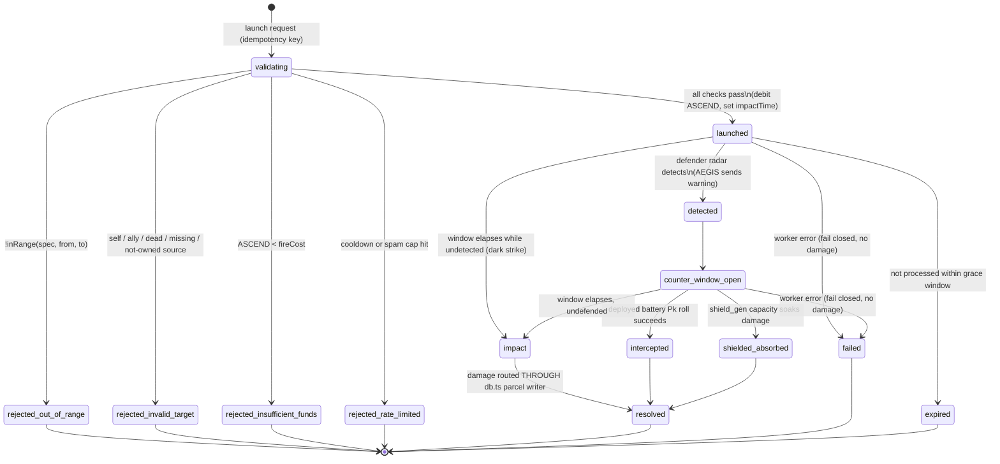

# STRIKE SYSTEM — Design Spec v0.1

**Status:** Design only. **No game code in this unit.** Every gameplay number below
is `PROPOSED` and must be balance-tested before it is treated as fact. Code
references are cited `file:line` against the repo as of this writing and were
spot-verified while drafting.

**Purpose.** FRONTIER-AL ships a full 38-weapon catalog and a working
invasion/battle engine, but **firing a weapon currently has no mechanical effect on
a parcel.** `fireWeapon()` resolves an engagement *synchronously at launch* and only
updates player stats — there is, in its own words, "no later server tick"
(`server/weapons/service.ts:196-197`). This spec describes a server-authoritative,
fail-closed **strike lifecycle** that closes that gap: a launched strike has a real
flight window, can be detected and countered, and — on impact — routes damage
through the canonical parcel writer. A neutral arbiter ("AEGIS") owns the clock and
adjudicates every outcome deterministically.

This document supersedes the original PROPOSED draft. The draft carried several
"NOT VERIFIED" assumptions that the code contradicts; §0 records the corrections so
the build chats start from facts.

---

## 0. Verified facts vs. PROPOSED (read this first)

| # | Draft assumption | Reality (cited) | Consequence for design |
|---|---|---|---|
| 1 | Distance in **hex steps**, ~150 ≈ hemisphere | World is **continuous lat/lng**; range is great-circle **km** (`shared/weapons/ballistics.ts:103` `inRange`; `shared/weapons/scale.ts:77` `greatCircleKm`); planet radius **1,200 km** (`scale.ts:22`) | §2 banding is rebuilt on real `rangeKm`/`speedMps`. No hex model. |
| 2 | Assign an invented **P/T/B/S/H/O class** to each weapon | `WeaponSpec.category` already exists: `ballistic \| cruise \| hypersonic \| artillery \| rocket_artillery \| anti_air \| missile_defense` (`shared/weapons/types.ts:16-35`), plus `tier` 1-4 (`types.ts:93`) | Map roles onto the **existing** `category`/`tier`; do not invent names. |
| 3 | `WeaponSpec` has no `description` | Confirmed — no `description` field (`types.ts:88-124`). Human text lives in `DEFENSE_IMPROVEMENT_INFO`/`FACILITY_INFO` (`shared/schema.ts`) | If strikes need player-facing copy, source it from the schema info maps or add a field in a later unit. |
| 4 | Parcel state is owned by `server/engine/battle/resolve.ts` | `resolve.ts` is a **pure, stateless reducer**; the **canonical parcel writer** is `server/storage/db.ts` `resolveBattles()` (`:1630`), which mutates under an **atomic claim** (`UPDATE … status='resolved'`, `:1693-1697`) | Strike damage must be applied **through the `db.ts` writer path**, not through the pure reducer. |
| 5 | Weapon damage never reaches the parcel | Confirmed. `fireWeapon()` (`service.ts:155-220`) spends ASCEND + updates player stats only; the engagement carries a `damage` field (`engagementStore.ts:41,149`) that is **never consumed**; resolution is synchronous ("no later server tick", `service.ts:196-197`) | This is the whole point of the system: add a delayed-impact tick + damage routing. |
| 6 | `radar` wired; `data_centre` / `ai_lab` **NOT** wired | `radar` **is** wired (−10% attacker power: `hasRadar`/`radarMod=0.9`, `db.ts:1259-1270`). `data_centre` **is** wired (yield `+0.05*level`, `db.ts:1086`). `ai_lab` **is** wired (mine-cooldown reduction, `db.ts:676`). `shield_gen`/`turret` add defense (`db.ts:1082-1083`) | The draft's "NOT wired" claim is wrong. All four are wired today. |
| — | An `interceptor` **upgrade** exists | **No such upgrade.** Point-defense is a **deployable weapon** (`anti_air` / `missile_defense` `def_*` ids), deployed via `deployDefense()` (`service.ts:222`) | The counter-window uses **deployed batteries**, not a built upgrade. |
| — | The arbiter is freely named "AEGIS" | "AEGIS" **collides** with the in-game `aegis` interception badge (`types.ts:64`) and the `def_aegis` "Aegis SM-6" battery (`defense.ts:55`) | Keep AEGIS as working name (decision), but flag the collision; a rename may reduce confusion. |

Everything else in this doc is design intent, marked `PROPOSED`.

---

## 1. Strike lifecycle state machine

Server-authoritative. A **pure reducer** defines legal transitions (mirroring the
style of `server/engine/battle/resolve.ts`); a worker advances the time-based ones
using the **server clock only**. Every terminal-by-error path **fails closed** — no
phantom damage, no silent economic change.

> **What changes vs. today:** `fireWeapon()` resolves synchronously at launch
> (intercepted-or-hit, no flight window, no parcel write). The strike lifecycle
> introduces a real `launch → impact` delay derived from `timeOfFlightMs()`
> (`ballistics.ts:49`), a defender counter-window, and a damage step that writes
> through `db.ts`.



| State | Meaning | Key rule | Reuse / cite |
|---|---|---|---|
| `validating` | Gatekeeper checks | Range (`inRange`), source-ownership, funds, cooldown, idempotency — all server-side | `service.ts:174-177` (ownership+range today); `server/idempotencyGuard.ts`; `server/routeOwnership.ts` |
| `rejected_*` | Launch refused | Terminal. No ASCEND debited. Clear reason to player | mirror `service.ts:176` error text |
| `launched` | In flight | ASCEND debited; set `launchTime` + `impactTime = launch + timeOfFlightMs(spec,dist)` | `spendAscend` (`service.ts:179`); `timeOfFlightMs` (`ballistics.ts:49`) |
| `detected` | Defender warned | Fires only if radar-derived lead > 0; AEGIS dispatches the notice over WS | radar mod (`db.ts:1259-1270`); WS push (`server/wsServer.ts` `markDirty`/broadcast) |
| `counter_window_open` | Defender may act | Deployed `anti_air`/`missile_defense` batteries + `shield_gen` capacity may engage until impact | `deployDefense` (`service.ts:222`); intercept envelopes (`antiAir.ts`/`defense.ts`) |
| `intercepted` | Strike neutralized | Pk roll succeeds (seeded; may be partial). Logged | seeded RNG `mulberry32`/`hashSeed` (`resolve.ts`) |
| `shielded_absorbed` | Shield soaked it | `shield_gen` capacity depleted, no parcel change | `shield_gen` defense (`db.ts:1083`) |
| `impact` | Hit lands | Damage computed, routed through the **db.ts** parcel writer | `db.ts` `resolveBattles` writer pattern (`:1630`, atomic claim `:1693-1697`) |
| `resolved` | Done | `game_events` row + both-player WS notice | `addEvent` (`db.ts:181`); `gameEvents` table (`server/db-schema.ts`) |
| `failed` | Worker error | **Fail closed**: no damage; ASCEND refund-or-hold flagged; AEGIS alerts admin | — |
| `expired` | Stale safety net | Worker outage past grace window → do not apply old damage; flag for reconciliation | mirror battle reconciliation on restart |

**Dark strikes:** if the defender's radar can't detect the launch, the strike skips
`detected`/`counter_window_open` and goes straight to `impact`. Low/no radar = surprise
attack. That is the incentive to invest in `radar` (already wired, `db.ts:1259`). See
§5 for the agreed dark-strike severity (very-late warning, **not** zero).

---

## 2. Weapon range & speed banding (grounded in the real catalog)

Geography gates everything: a launch is legal only when `inRange(spec, from, to)`
(`ballistics.ts:103`) — out of range is rejected, it never "goes anywhere." The
flight window comes from the existing deterministic flight model:

```
impactTime = launchTime + timeOfFlightMs(spec, greatCircleKm(from, to))   // ballistics.ts:49
effectiveWarning = min(timeOfFlight, radarDerivedLead)                     // PROPOSED
```

`timeOfFlightMs` already accounts for the flight profile path factor
(`ballistics.ts:25-30`), so the strike worker should reuse it rather than invent a
speed model. **No hex steps; all distances are km, all speeds m/s.**

### Role bands mapped onto the existing `category` + `tier`

The draft's invented P/T/B/S/H/O classes are unnecessary — the catalog already
bands the weapons. The mapping:

| Role band (PROPOSED) | Existing `category` | Offensive? | Counter difficulty | Notes |
|---|---|---|---|---|
| Tactical / short | `artillery` | yes | easy–medium | local; lowest cost; fast, short window |
| Salvo / medium | `rocket_artillery` | yes | medium | regional reach |
| Ballistic | `ballistic` | yes | medium | high apex, steep dive |
| Cruise / long | `cruise` | yes | medium | very long range, **slow** → long warning |
| Hypersonic | `hypersonic` | yes | **hard** | little warning → should cost the most |
| Point/area defense | `anti_air`, `missile_defense` | **no** | *is* the counter | deployed, carries `intercept` envelope |

Offensive vs. defensive split is already encoded: `OFFENSIVE_CATEGORIES` /
`DEFENSIVE_CATEGORIES` (`types.ts:26-35`). Only offensive categories may be
**launched**; defensive categories are **deployed** (`service.ts:163,222`).

### The full 38 (real ids + real stats; ETA is derived, PROPOSED)

The 38 weapons live in `shared/weapons/{missiles,artillery,antiAir,defense}.ts`
(12 + 12 + 8 + 6). Ranges/speeds below are **real catalog values**; the "ETA @ max
range" column is **derived** via `timeOfFlightMs()` and is `PROPOSED` for gameplay —
it may need a game-time compression factor (see note after the table).

**Offensive — Missiles (`missiles.ts`)**

| id | name | category | tier | rangeKm | speedMps | profile | ETA @ max (derived) |
|---|---|---|---|---|---|---|---|
| `msl_ballistic_1` | Lancet TBM | ballistic | 1 | 165 | 1030 | ballistic | ~3.1 min |
| `msl_ballistic_2` | Lancet-ER | ballistic | 2 | 300 | 1200 | ballistic | ~4.9 min |
| `msl_ballistic_3` | Vanguard SRBM | ballistic | 3 | 415 | 1700 | ballistic | ~4.8 min |
| `msl_ballistic_4` | Vanguard-M | ballistic | 4 | 500 | 2100 | ballistic | ~4.7 min |
| `msl_cruise_1` | Gale TLAM | cruise | 1 | 1600 | 240 | cruise_low | ~1.85 hr |
| `msl_cruise_2` | Gale Block IV | cruise | 2 | 1800 | 245 | cruise_low | ~2.04 hr |
| `msl_cruise_3` | Gale Maritime | cruise | 3 | 2100 | 250 | cruise_low | ~2.33 hr |
| `msl_cruise_4` | Gale-ER | cruise | 4 | 2400 | 260 | cruise_low | ~2.56 hr |
| `msl_hyper_1` | Meteor HGV | hypersonic | 1 | 500 | 1700 | boost_glide | ~5.2 min |
| `msl_hyper_2` | Meteor-II | hypersonic | 2 | 1000 | 2400 | boost_glide | ~7.4 min |
| `msl_hyper_3` | Meteor Glide | hypersonic | 3 | 1500 | 3000 | boost_glide | ~8.8 min |
| `msl_hyper_4` | Meteor Apex | hypersonic | 4 | 2000 | 3400 | boost_glide | ~10.4 min |

**Offensive — Artillery (`artillery.ts`)**

| id | name | category | tier | rangeKm | speedMps | profile | ETA @ max (derived) |
|---|---|---|---|---|---|---|---|
| `art_towed_1` | Field Gun 105 | artillery | 1 | 14 | 470 | parabolic | ~33 s |
| `art_towed_2` | Howitzer 155 | artillery | 2 | 24 | 560 | parabolic | ~47 s |
| `art_towed_3` | Howitzer 155 PGM | artillery | 3 | 40 | 580 | parabolic | ~76 s |
| `art_towed_4` | Howitzer 155 RAP | artillery | 4 | 70 | 600 | parabolic | ~2.1 min |
| `art_rocket_1` | Salvo MRL | rocket_artillery | 1 | 40 | 690 | parabolic | ~64 s |
| `art_rocket_2` | GMLRS Strike | rocket_artillery | 2 | 84 | 1000 | parabolic | ~92 s |
| `art_rocket_3` | GMLRS-ER | rocket_artillery | 3 | 150 | 1100 | parabolic | ~2.5 min |
| `art_rocket_4` | PrSM Tactical | rocket_artillery | 4 | 300 | 1500 | parabolic | ~3.7 min |
| `art_mlrs_1` | Heavy MLRS | rocket_artillery | 1 | 165 | 1050 | parabolic | ~2.9 min |
| `art_mlrs_2` | Heavy MLRS-ER | rocket_artillery | 2 | 300 | 1200 | parabolic | ~4.6 min |
| `art_mlrs_3` | Heavy MLRS-TBM | rocket_artillery | 3 | 400 | 1400 | parabolic | ~5.2 min |
| `art_mlrs_4` | Heavy MLRS Apex | rocket_artillery | 4 | 480 | 1550 | parabolic | ~5.7 min |

**Defensive — Anti-Air (`antiAir.ts`) and Missile Defense (`defense.ts`)** — deployed, not launched; each carries an `intercept` envelope (`interceptRangeKm`, `maxAltKm`, `interceptorSpeedMps`, `reactionMs`, `basePk`, `magazine`).

| id | name | category | tier | interceptRangeKm | basePk | reactionMs | magazine |
|---|---|---|---|---|---|---|---|
| `aa_short_1` | Stinger MANPADS | anti_air | 1 | 8 | 0.45 | 4000 | 4 |
| `aa_short_2` | NASAMS AMRAAM | anti_air | 2 | 30 | 0.60 | 5000 | 6 |
| `aa_med_1` | NASAMS-ER | anti_air | 2 | 50 | 0.62 | 6000 | 6 |
| `aa_med_2` | Patriot PAC-2 | anti_air | 3 | 96 | 0.68 | 7000 | 8 |
| `aa_long_1` | Patriot PAC-3 MSE | anti_air | 4 | 120 | 0.75 | 7000 | 8 |
| `aa_long_2` | S-400 48N6 | anti_air | 3 | 250 | 0.70 | 8000 | 10 |
| `aa_long_3` | S-400 40N6 | anti_air | 4 | 400 | 0.72 | 9000 | 12 |
| `aa_exo_1` | Arrow-3 Exo | anti_air | 4 | 300 | 0.80 | 9000 | 6 |
| `def_cram` | C-RAM Point Defense | missile_defense | 1 | 4 | 0.55 | 1500 | 40 |
| `def_pointiron` | Iron Dome Battery | missile_defense | 1 | 70 | 0.65 | 3000 | 20 |
| `def_sling` | David's Sling | missile_defense | 2 | 300 | 0.74 | 6000 | 12 |
| `def_thaad` | THAAD Terminal | missile_defense | 3 | 200 | 0.80 | 7000 | 8 |
| `def_aegis` | Aegis SM-6 | missile_defense | 3 | 370 | 0.82 | 7000 | 10 |
| `def_arrow_exo` | Arrow-3 Shield | missile_defense | 4 | 600 | 0.88 | 8000 | 6 |

> **Balance note (PROPOSED).** Cruise ETAs of ~2 hours are realistic but may be too
> long for session-scale play. The strike worker should apply a single tunable
> **game-time factor** to `timeOfFlightMs()` output (one constant, in the engine
> `tuning` style) rather than editing per-weapon `speedMps` — that keeps the
> physics/render model intact while compressing gameplay windows. The tension the
> spec wants — *hypersonic + low-radar = almost no warning = the "oh no" weapon* —
> already falls out of the real numbers: a Meteor at ~10 min of flight against an
> undetecting defender is the surprise weapon and should carry the highest fire
> cost (its real `costAscend` is already the highest in the catalog, 90–230).

---

## 3. AEGIS — the arbiter agent ("the UN of the cluster")

**Working name:** AEGIS (Autonomous Engagement & Governance Integrity Service).
Kept as the working name (decision). **Collision flag:** "AEGIS" already means
something in this game — the `aegis` interception **badge** (`types.ts:64`) and the
`def_aegis` "Aegis SM-6" **battery** (`defense.ts:55`). A rename (alts: *The
Concord*, *Arbiter Command*, *Tribunal*) would avoid player confusion; decide
before build. In-world flavor: a neutral peacekeeping command that observes all
warfare, issues warnings, and adjudicates outcomes.

### Design principle — split brain

- **Referee core = deterministic server code.** Decides *every* outcome: validation,
  the authoritative clock, interception math, damage, parcel writes. Single source
  of truth. Pure + testable + reproducible — same discipline as `resolve.ts`
  (pure reducer) feeding `db.ts` (the writer). Seeded with `mulberry32`/`hashSeed`
  so a strike is replayable.
- **Ops layer = optional LLM, cordoned.** Only reversible, non-irreversible work:
  drafting notification copy, war-report narration, surfacing anomalies to the admin
  dashboard. Output is Zod-validated, logged, and **never** the source of truth for
  who-hit-whom or who-owns-what. (Mirrors the existing non-blocking narrative layer,
  `server/engine/narrative/*`.)

### Responsibilities (what AEGIS SHOULD own) — each mapped to a reuse target

1. **Launch authority** — the one gatekeeper running validation (range, ownership,
   funds, rate-limit, idempotency). Reuse `idempotencyGuard.ts` (claim/replay) +
   `routeOwnership.ts`; consider `rateLimitStore.ts` for per-player launch caps.
2. **Authoritative clock & scheduling** — owns `launchTime`/`impactTime`; only
   AEGIS's resolution job transitions `impact`. No client time, ever. Reuse the
   existing `setInterval` worker pattern (battle-resolve loop in `db.ts`; season
   manager `server/engine/season/manager.ts:37`). See §5 (scheduler decision).
3. **Notification dispatch** — radar-gated "incoming detected" warning to the
   defender + outcome notices to both players. Reuse the WS push path
   (`server/wsServer.ts` `markDirty`/broadcast).
4. **Deterministic resolution** — interception → shield → damage in pure code,
   written **through the `db.ts` parcel writer** under an atomic claim (mirror
   `resolveBattles` `:1693-1697`). The referee of every strike.
5. **Audit & observability** — a `game_events` row per transition (`addEvent`,
   `db.ts:181`; `gameEvents` table in `db-schema.ts`); powers the admin dashboard.
6. **Abuse detection** — launch spam / notification DOS, sybil bursts, impossible
   distances (caught by `inRange`), clock-spoof attempts, refund abuse → risk signals.
7. **Bounded safety control** — may trip a strike-system pause/kill-switch *within
   pre-defined safe limits* (e.g. halt new launches past an anomaly threshold) and
   flag a human. Reversible only.
8. **Reconciliation on restart** — process due strikes, expire stale ones (the
   `expired` state), so nothing is lost or phantom after a worker outage.

### Hard limits (what AEGIS MUST NOT do)

- Not invent combat outcomes via LLM — resolution is deterministic.
- Not move economy / award rewards / mint / send chain tx autonomously without human
  approval + validation. (Funds paths stay gated by `/mainnet-gate` + `algo-auditor`.)
- Not ban players autonomously — flag for a human.
- Not modify production config or balance numbers autonomously.

### Optional value-adds (PROPOSED menu)

Intel & flavor (validated LLM war reports / threat levels); diplomacy hooks
(ceasefires, sanctuary parcels, cooldown zones); **offline-defender assist** (see
§5 — IN for v1); global event engine (scheduled meteor storms / faction wars);
economy watchdog (ASCEND sink/faucet ratio from strikes); battle replay & forensics
(the deterministic seeded log enables a replay UI).

---

## 4. Management layer — Clerk (admin/ops only, v1)

**Decision: Clerk is a staff/ops management layer that augments — does not replace —
the existing wallet auth.** Today there is no Clerk anywhere in the repo (verified).

### What exists today

- **Player auth:** Sign-In-With-Algorand — wallet signs a nonce, server verifies the
  ed25519 signature and issues an HMAC session (`server/auth.ts`). The Algorand
  **wallet address is the on-chain identity** the economy depends on.
- **Admin gate:** a single static `ADMIN_KEY` checked by `requireAdminKey()`
  (`server/security.ts:40-77`; constant-time compare, fails closed in prod). It
  guards `/api/admin/*` and game-control routes. The client `/admin` page
  (`client/src/pages/admin.tsx`) stores the key in `sessionStorage` and is otherwise
  **unguarded on the client**.

### Where Clerk plugs in (design only — not built in this unit)

1. **Gate the admin / AEGIS ops surface.** Replace the single shared `ADMIN_KEY`
   with **Clerk Organizations + roles** (e.g. `global-admin` vs. read-only `ops`),
   so staff are managed without rotating an env secret and every admin action has an
   identity behind it. Server side: a middleware verifying a **Clerk JWT** as an
   accepted alternative to `x-admin-key` (keep `requireAdminKey` as the fallback /
   break-glass). Client side: wrap the `/admin` route in a Clerk auth guard — it is
   currently reachable with no client-side check.
2. **Provider mount.** A `<ClerkProvider>` would sit above the wouter routes in
   `client/src/App.tsx` (alongside/above the existing `QueryClientProvider` /
   `UseWalletProvider` stack). Player-facing pages keep using the wallet context
   unchanged.
3. **Env vars (add when implemented).** `CLERK_SECRET_KEY` (server) and
   `VITE_CLERK_PUBLISHABLE_KEY` (client), documented in `ENV_VARS.md` +
   `docs/DEPLOYMENT_ENV_CHECKLIST.md`. Onboarding via the Clerk skills install
   (`npx skills add clerk/skills`).

### Hard limits on Clerk

- **Player identity stays wallet-based.** Clerk does **not** become player identity
  in v1; the Algorand address remains the on-chain source of truth.
- **API-level controls only.** A Clerk role grants dashboard/route access — it has
  **no on-chain or economy authority**. Admin mutations still pass full server
  validation; nothing about Clerk bypasses `/mainnet-gate` or `algo-auditor`.

### Future hook (explicitly OUT of v1 scope)

The four factions already exist (`ai_faction_identities` and `playerFactionId` in
`server/db-schema.ts`). Mapping factions → Clerk Organizations for *player*
membership/roles is a natural later extension, but it intersects on-chain faction
alignment and is **not** part of this admin-only design.

---

## 5. Open decisions — recommended defaults (PROPOSED, awaiting sign-off)

Recorded as recommended defaults with rationale; still flagged PROPOSED / sign-off-pending.

1. **Scheduler for delayed impact → reuse the in-process `setInterval` loop.** The
   repo already advances time-based game state with in-process intervals (battle
   resolve loop in `db.ts`; season manager `manager.ts:37`). Add the strike tick to
   that pattern and **atomic-claim** each due strike exactly like `resolveBattles`
   (`db.ts:1693-1697`). **Do not** use Kestra: CLAUDE.md forbids Kestra pointing at
   mainnet, and an in-process loop keeps the referee co-located with the writer.
2. **Loot → none. Strikes are an ASCEND sink + denial tool.** No lootable rewards,
   to kill farm loops. Fire cost (`costAscend`) is the sink; the payoff is denial
   (damaging/degrading the target's parcel), not income.
3. **Offline-defender assist → IN for v1, bounded.** During the counter-window,
   auto-engage **only the shields/batteries the defender already owns and deployed**,
   using their own resources. Cuts pure griefing of offline players without giving
   free defense.
4. **Dark-strike severity → very-late warning, not zero.** Zero radar yields a
   *very late* detection (a sliver of counter-window), never *no* warning. Preserves
   a counter chance and reduces griefing while keeping the incentive to invest in
   `radar` (`db.ts:1259`).
5. **AEGIS name → keep as working name** (with the collision flag from §0/§3 noted).

---

## 6. Scope & guardrails

- **This unit is design only.** No game code, schema, migration, route, or config
  changed.
- When the strike system is built: **damage must route through the `db.ts` parcel
  writer** (§0 #4), never through the pure reducer or the client.
- Any new mutating strike route must be added to `MUTATION_PATH_RE`
  (`server/routes.ts:498-518`) or it bypasses the global mutation guard.
- No funds / ASA / mainnet behavior may change without a `/mainnet-gate` PASS **and**
  an `algo-auditor` pass. Nothing in `ops/kestra/` may point at mainnet.
- Do not reintroduce mock/demo data into plot/HUD surfaces — they are live,
  server-driven.
- Reuse the centralized guards (`idempotencyGuard.ts`, `routeOwnership.ts`,
  `rateLimitStore.ts`, `security.ts`) rather than scattering new logic.

---

### Appendix — derivation of the ETA column

ETA uses the repo's own model, no new math:
`timeOfFlightMs(spec, d) = round( d · PROFILE_PATH_FACTOR[profile] · 1000 / speedMps · 1000 )`
(`shared/weapons/ballistics.ts:49-53`), with path factors ballistic 1.18 /
parabolic 1.10 / boost_glide 1.06 / cruise_low 1.00 (`ballistics.ts:25-30`),
evaluated at `d = rangeKm`. Values are rounded for readability and are `PROPOSED`
for gameplay (subject to the game-time factor in §2).
